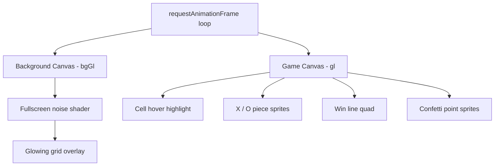
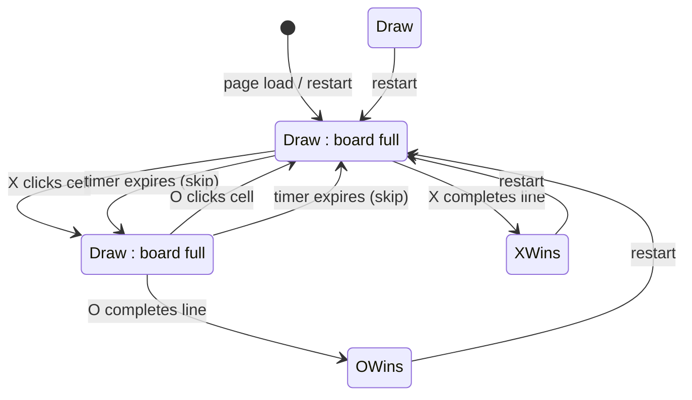
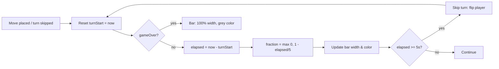
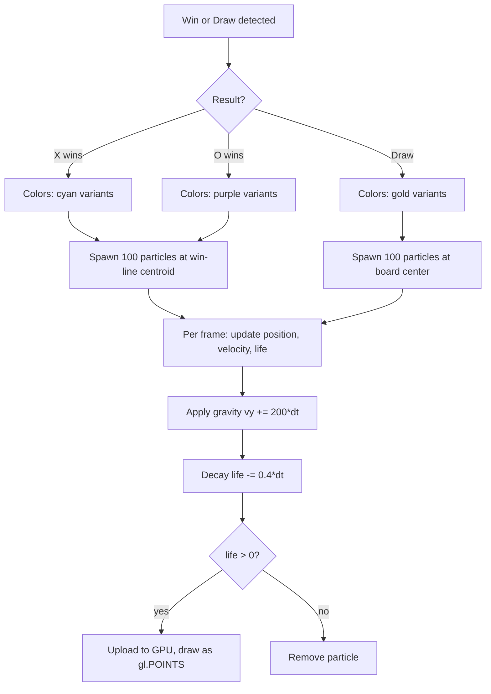

# Tic-Tac-Toe

**Neon meets nostalgia.** A classic game reimagined with real-time WebGL rendering — animated piece entrances, glowing grid lines, a ticking countdown that bleeds from green to red, and a confetti explosion when you claim victory. No frameworks, no build step, no dependencies. One file, one browser, pure GPU-accelerated fun.

## Features

- **WebGL-rendered board** — animated noise background with glowing grid lines
- **Animated pieces** — X and O spring into view with an elastic easeOutBack animation and per-piece rotation
- **5-second turn timer** — color-shifting progress bar (green → yellow → red); turns skip automatically on timeout
- **Win detection** — animated line sweeps across the winning combination
- **Confetti celebration** — 100 WebGL point-sprite particles burst from the winning line (or board center on draw), with gravity, fade, and player-matched colors
- **Pulsing status text** — glow animation colored to match the winner (cyan for X, purple for O, gold for draw)
- **Hover highlights** — translucent cell highlight on mouseover
- **Zero dependencies** — no npm, no build tools, runs directly in any modern browser

## Quick Start

Open `index.html` in a browser. That's it.

```bash
# macOS
open index.html

# Linux
xdg-open index.html

# Or just double-click the file in your file manager
```

No server required. No installation step.

## Architecture

The entire game lives in a single `index.html` file — HTML structure, CSS styles, and two WebGL rendering pipelines all self-contained.

### Rendering Pipeline

Two `<canvas>` elements share a 420×420 CSS-pixel viewport (scaled by `devicePixelRatio` for crisp rendering on HiDPI screens):



| Layer | Canvas | GL Context | Content |
|-------|--------|------------|---------|
| Background | `bg-canvas` | `bgGl` | Procedural noise + animated grid glow |
| Game | `game-canvas` | `gl` | Hover, pieces, win line, particles |

The background canvas is opaque; the game canvas has alpha transparency and composites on top.

### Game State Machine



The timer resets on every move and every skip. Game-over states freeze the timer and trigger the celebration system.

### Turn Timer



The timer bar uses `hsl(fraction * 120, 100%, 50%)` for a continuous green → yellow → red gradient.

### Particle Celebration System



Each particle is a WebGL point sprite rendered through a custom vertex/fragment shader pair. The vertex shader scales `gl_PointSize` by `devicePixelRatio` for correct sizes on retina displays. The fragment shader creates a soft glowing circle via `smoothstep` distance-based alpha.

## WebGL Shaders

The game uses 6 shader programs across the two canvases:

| Program | Canvas | Purpose |
|---------|--------|---------|
| `bgProg` | Background | Fullscreen noise + grid glow |
| `xProg` | Game | Cyan X pieces with pulsing glow |
| `oProg` | Game | Purple O pieces with pulsing glow |
| `lineProg` | Game | Animated win-line sweep |
| `hoverProg` | Game | Translucent cell highlight |
| `particleProg` | Game | Confetti point sprites |

All game-layer programs share a common scene-space coordinate system (0–420 game pixels) converted to clip space via `toClip()`. The particle program converts independently using its `u_res` uniform.

## File Structure

```
.
├── index.html          # Complete game (HTML + CSS + JS + shaders)
└── docs/
    └── turn-timer-plan.md   # Design document for timer & celebration
```

## Development

Since there's no build system, just edit `index.html` and refresh the browser. For live reloading, any static file server works:

```bash
# Python
python3 -m http.server 8000

# Node (npx, no install needed)
npx serve .
```

## Deployment

The project is deployed on Vercel and auto-deploys from the `master` branch on pushes to GitHub. The single-file architecture means zero build configuration — Vercel serves `index.html` as-is.

## Browser Support

Any browser with WebGL support (all modern browsers). Tested on Chrome, Firefox, Safari, and Edge.